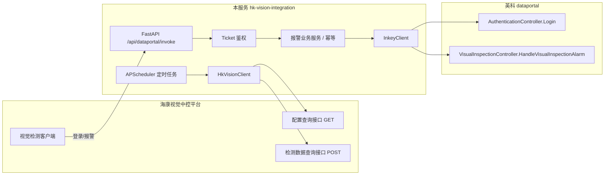

# HK Vision Integration（海康视觉 ↔ 英科 dataportal 对接服务）

海康视觉中控平台与英科系统之间的 HTTP 对接中间服务。主要承接：

1. **海康 → 英科 方向（本服务作为英科侧入口代理）**：提供与英科 dataportal 一致的 `/api/dataportal/invoke` 入口，海康侧先登录拿 Ticket，再通过 `HandleVisualInspectionAlarm` 上传报警（发生时一次、处理完成时一次）。
2. **英科 → 海康 方向（本服务主动拉取）**：按需调用海康的「配置查询」「视觉检测数据查询」接口，同步基础字典与每小时缺陷统计数据。

> 需求来源：父目录 `01-接口需求整理.md` / `02-对接Checklist.md` / `03-openapi-draft.yaml`。

---

## 架构总览



---

## 接口清单

| # | 方向 | 本服务角色 | 路径 / 方法 | 说明 |
|---|---|---|---|---|
| 1 | 海康→本服务 | **对外提供** | `POST /api/dataportal/invoke` (ApiType=AuthenticationController, Method=Login) | 登录获取 Ticket（骨架，M2 对接真实英科） |
| 2 | 海康→本服务 | **对外提供** | `POST /api/dataportal/invoke` (ApiType=VisualInspectionController, Method=HandleVisualInspectionAlarm) | 报警上传，含幂等去重 |
| 3 | 本服务→海康 | 主动调用 | 海康配置查询 GET（URL 待海康提供） | 同步产线/缺陷/面别字典 |
| 4 | 本服务→海康 | 主动调用 | 海康检测数据查询 POST（URL 待海康提供） | 按整点拉缺陷统计 |
| 5 | 本服务→英科 | 转发/调用 | `POST /api/dataportal/invoke`（英科基地址） | M2 对接英科登录与报警上传 |
| — | 运维 | 内部 | `GET /healthz` | 健康检查 |

> 最终接口契约以 `docs/openapi-draft.yaml` 为准。

---

## 目录结构

```
hk-vision-integration/
├── README.md                 # 本文件
├── PROJECT-PLAN.md           # 项目规划（里程碑/任务/风险）
├── pyproject.toml            # 依赖声明（poetry）
├── .env.example              # 环境变量模板
├── .gitignore
├── docs/
│   └── openapi-draft.yaml    # 从父目录复制的接口契约草案
├── src/hk_integration/
│   ├── __init__.py
│   ├── main.py               # FastAPI 入口
│   ├── config.py             # pydantic-settings 配置
│   ├── logging.py            # loguru 日志
│   ├── scheduler.py          # APScheduler 启停
│   ├── api/
│   │   ├── routes/
│   │   │   ├── health.py     # /healthz
│   │   │   └── alarm.py      # /api/dataportal/invoke 入口
│   │   └── schemas/
│   │       ├── dataportal.py # 通用信封模型（PascalCase alias）
│   │       └── alarm.py      # 报警对象模型
│   ├── clients/
│   │   ├── hk_client.py      # 海康 HTTP 客户端（M3 补真实实现）
│   │   └── inkey_client.py   # 英科 HTTP 客户端（M2 补真实实现）
│   ├── services/
│   │   ├── auth.py           # Ticket 内存缓存
│   │   ├── alarm_service.py  # 报警幂等去重/落日志
│   │   └── sync_service.py   # 定时同步骨架
│   └── models/
│       ├── enums.py          # WorkShop/AlarmLevel/AlarmResult 枚举
│       └── domain.py         # 领域数据模型
└── tests/
    ├── test_health.py
    └── test_alarm_api.py
```

---

## 环境要求

- Python 3.11+
- [Poetry](https://python-poetry.org/) 1.7+（或用 pip + venv，见下方）

## 快速启动

```bash
# 1. 进入项目目录
cd hk-vision-integration

# 2. 安装依赖（推荐 poetry）
poetry install

# 3. 准备环境变量
cp .env.example .env
# 编辑 .env，按需修改 INKEY_BASE_URL / HK_BASE_URL / 账号密码等

# 4. 启动服务（开发模式，带热重载）
poetry run python -m hk_integration.main
# 或
poetry run uvicorn hk_integration.main:app --host 0.0.0.0 --port 8000 --reload

# 5. 健康检查
curl http://127.0.0.1:8000/healthz
```

## 运行测试

```bash
poetry run pytest -v
```

> 当前骨架可直接启动 `/healthz`；报警接口可接收合法 Ticket 返回 200，但内部不真正转发英科/海康（M2/M3 补齐）。

## 环境变量（节选自 `.env.example`）

| 变量 | 说明 | 默认 |
|---|---|---|
| `APP_ENV` / `APP_HOST` / `APP_PORT` | 运行环境/监听地址/端口 | dev / 0.0.0.0 / 8000 |
| `INKEY_BASE_URL` | 英科 dataportal 基地址 | http://192.168.32.86:1025 |
| `INKEY_USERNAME` / `INKEY_PASSWORD` | 英科登录账号 | HKSJSB / HKSJSB123 |
| `HK_BASE_URL` | 海康视觉中控基地址（**待海康提供**） | http://TODO-HIK-HOST:TODO-HIK-PORT |
| `DEFAULT_WORKSHOP` | 默认车间代码 | HBN1 |
| `CONFIG_SYNC_CRON` / `DETECTION_SYNC_CRON` | APScheduler CronTrigger 表达式 | 每 30 分钟 / 每小时整点 5 分 |
| `TICKET_TTL_SECONDS` | Ticket 本地缓存 TTL（秒，待确认实际有效期） | 1800 |

## 已知风险与待确认项

见 `PROJECT-PLAN.md` → 风险章节，完整对齐清单见父目录 `01-接口需求整理.md` 第五节（共 13 项）。
