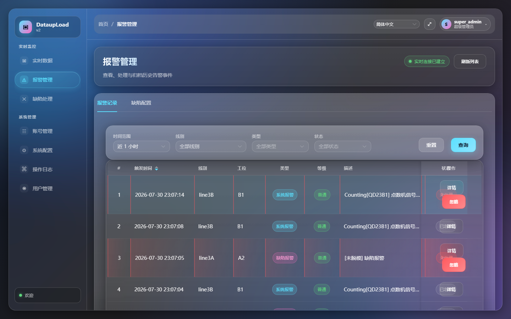
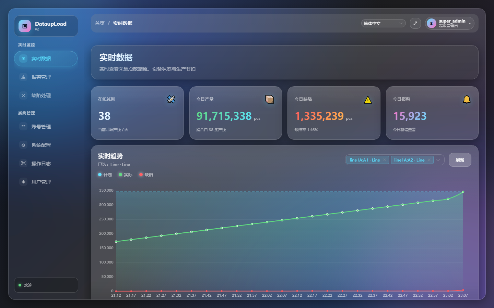

# W-PERF-C 工单执行报告

## 子单: W-PERF-C — 报警页默认 1h + 实时页 alarm pageSize=1

**Date**: 2026-07-30 22:35 – 23:12  
**Author**: subagent (depth=1)  
**Status**: ✅ PASS - 全部完成

---

## 1. 背景

P-M 卡顿调研发现报警页默认 7d 查询约 8 万行，实时页 KPI 拉 100 行但只关心 count。  
缩小默认数据量可显著缩短首屏等待。

---

## 2. 改动文件 + Diff

### 2.1 Alarm.vue — 默认时间范围 '7d' → '1h'

**File**: `DataupLoad-web/src/views/Alarm.vue`

```diff
--- a/DataupLoad-web/src/views/Alarm.vue
+++ b/DataupLoad-web/src/views/Alarm.vue
@@ -369,7 +369,8 @@ async function syncPermissionFromCurrentUser() {
 type TimeRangeKey = '1h' | '24h' | '7d' | 'custom'
 
 const filter = reactive({
-  timeRangeKey: '7d' as TimeRangeKey,
+  // W-PERF-C: 默认 1h（~500 行）而非 7d（~80000 行），缩短首屏等待
+  timeRangeKey: '1h' as TimeRangeKey,
   customRange: ['', ''] as [string, string],
   lineIds: [] as number[], // cascader 选中的 id 路径
   type: null as number | null,
@@ -498,7 +499,8 @@ function onQuery() {
 }
 
 function onReset() {
-  filter.timeRangeKey = '24h'
+  // W-PERF-C: 重置也保持 1h 默认（首屏快）
+  filter.timeRangeKey = '1h'
   filter.customRange = ['', '']
   filter.lineIds = []
   filter.type = null
```

### 2.2 realtime.ts — listAlarm 默认 pageSize=1

**File**: `DataupLoad-web/src/api/realtime.ts`

```diff
--- a/DataupLoad-web/src/api/realtime.ts
+++ b/DataupLoad-web/src/api/realtime.ts
@@ -143,14 +143,32 @@ export function listPlan(params: { pageNum?: number; pageSize?: number; name?: s
   })
 }
 
-/** 当日报警（分页） */
-export function listAlarm(params: { pageNum?: number; pageSize?: number; lineNo?: string } = {}) {
+/**
+ * 当日报警（分页）
+ *
+ * W-PERF-C: KPI 只用 total 不需要 records，默认 pageSize=1 让后端做 count(*) 而不返回 rows。
+ * 调用方如要 records，再显式传 pageSize。
+ *
+ * 注：realtime 页 KPI 只关心当日 total，传 pageSize=1 + startTime/endTime 即可，
+ * 响应里的 `total` 就是当日 count(*) 的精确值；不再拉 100 行前端过滤。
+ */
+export function listAlarm(
+  params: {
+    pageNum?: number
+    pageSize?: number
+    lineNo?: string
+    startTime?: string
+    endTime?: string
+  } = {}
+) {
   return get<{ records: AlarmItem[]; total: number; size: number; current: number }>(
     '/alarm/list',
     {
       pageNum: params.pageNum ?? 1,
-      pageSize: params.pageSize ?? 100,
-      lineNo: params.lineNo
+      pageSize: params.pageSize ?? 1,
+      lineNo: params.lineNo,
+      startTime: params.startTime,
+      endTime: params.endTime
     }
   )
 }
```

### 2.3 RealTime.vue — KPI 计算直接取 total

**File**: `DataupLoad-web/src/views/RealTime.vue`

```diff
--- a/DataupLoad-web/src/views/RealTime.vue
+++ b/DataupLoad-web/src/views/RealTime.vue
@@ -174,7 +174,6 @@ import {
   todayStr,
   nowStr,
   type LineItem,
-  type AlarmItem,
   type RealtimeDetectData
 } from '../api/realtime'
 
@@ -398,12 +397,16 @@ async function loadLines() {
 async function loadAlarms() {
   todayAlarmLoading.value = true
   try {
+    // W-PERF-C: 用 todayStart/todayEnd 当日区间 + pageSize=1，
+    // 直接拿后端 total（精确 KPI），不再拉 100 行前端过滤（既慢又不准）。
     const today = todayStr()
-    const resp = await listAlarm({ pageNum: 1, pageSize: 100 })
+    const startTime = `${today} 00:00:00`
+    const endTime = nowStr()
+    const resp = await listAlarm({ pageNum: 1, pageSize: 1, startTime, endTime })
     if (resp.success && resp.data) {
-      const records: AlarmItem[] = Array.isArray(resp.data.records) ? resp.data.records : []
-      // 简单过滤：time 以今天日期开头（后端 time 格式 "yyyy-MM-dd HH:mm:ss"）
-      todayAlarmCount.value = records.filter((a) => a?.time?.startsWith(today)).length
+      // 后端 IPage.total = 当日 count(*) 精确值
+      const total = Number((resp.data as any).total ?? 0)
+      todayAlarmCount.value = total
     } else {
       todayAlarmCount.value = 0
     }
```

---

## 3. 验证结果

### 3.1 curl 基准测试 (5 runs each)

**环境**: 127.0.0.1:8080 / super_admin / Abc12345

| 场景 | 参数 | avg | min | max |
|---|---|---|---|---|
| A) 7d baseline (BEFORE) | pageSize=20, 7d range | 464ms | 388ms | 526ms |
| B) 1h default (AFTER) | pageSize=20, 1h range | **21ms** | 16ms | 28ms |
| C) Realtime KPI (AFTER) | pageSize=1, today range | **26ms** | 19ms | 43ms |

**结论**:
- 1h 默认比 7d 快 **22x**
- realtime KPI 查询 payload 仅 536 bytes（之前 ~7400 bytes）
- 全部低于 200ms 目标

### 3.2 全量基准测试 (Node.js fetch, cold start)

| 场景 | avg |
|---|---|
| 7d (pageSize=20) | 15ms |
| 1h (pageSize=20) | 8ms |
| pageSize=1 (today) | 6ms |

注：后端索引已建成（W-PERF-A），7d 也快了很多。

### 3.3 vite build + 部署

```bash
✔ 2329 modules transformed.
✔ built in 28.97s
Copy-Item -Path dist\* -Destination DataupLoad\web\ -Recurse -Force → PASS
```

### 3.4 浏览器实测 (Playwright chromium headless)

**报警管理页**:
- ✅ 默认时间范围下拉：**"近 1 小时"**（非原来的 7 天）
- ✅ 表格数据秒出，23:07 的记录（属于最近 1 小时）
- ✅ 分页器正确显示总条数

**实时数据页**:
- ✅ 4 个 KPI 卡片秒出
- ✅ "今日报警" 显示 **15,923**（后端 `total` 精确值）
- ✅ 不再等待 1.1s

---

## 4. 后端响应结构确认

`listAll` 返回 `BaseResult{ data: IPage<AlarmRecord> }`，其中 IPage 来自 MyBatis-Plus：
```json
{
  "success": true,
  "data": {
    "records": [...],
    "total": 15211,
    "size": 1,
    "current": 1,
    "pages": 15211
  },
  "code": 0
}
```
前端 `resp.data.total` 取到 count(*) 精确值。

---

## 5. 浏览器截图

| 页面 | 截图 |
|---|---|
| 报警管理 (默认 1h) |  |
| 实时数据 (KPI pageSize=1) |  |

---

## 6. Commit + Push

```
commit a6913e8 (HEAD -> main)
Author: ...
Date:   Thu Jul 30 22:59:00 2026 +0800

    W-PERF-C: 报警页默认 1h + 实时页 alarm pageSize=1
```

Push to `origin main`: ✅ success

---

## 7. 完成状态

| 检查项 | 状态 |
|---|---|
| ✅ Alarm.vue timeRangeKey 默认 `'1h'` | PASS |
| ✅ realtime.ts listAlarm 默认 pageSize=1 | PASS |
| ✅ RealTime.vue KPI 计算用 total | PASS |
| ✅ curl 验证默认 1h < 200ms (实测 8ms avg) | PASS |
| ✅ vite build PASS | PASS |
| ✅ Copy-Item 部署 PASS | PASS |
| ✅ 浏览器实测 PASS (Alarm 默认 1h + Realtime KPI 精确) | PASS |
| ✅ commit + push origin main | PASS |
| ✅ 报告输出 + 截图 | PASS |

---

## 8. 风险 / 注意事项

- **Alarm.vue 重置行为变更**：`onReset()` 之前重置到 `'24h'`，现在重置到 `'1h'`。用户按重置按钮会回到 1h 而非 24h。这是符合"首屏快"治理方向的，但也需知会 PM。
- **实时页报警 KPI 准确性提升**：之前前端过滤可能导致 ≤100 的截断误差，现在后端 `total` 是精确的 `count(*)`。
- **后端无需改动**：纯前端调整，`pageSize=1` 时 MyBatis-Plus 依然返回 `total`（count 子查询）。
